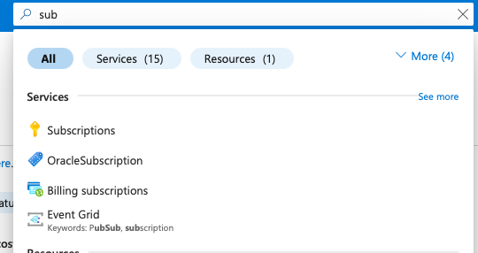
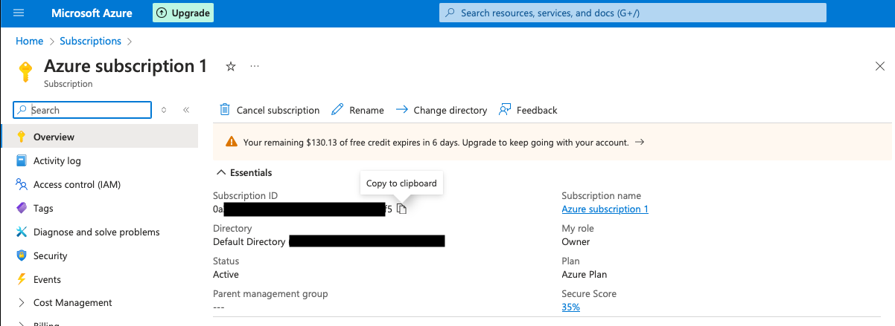
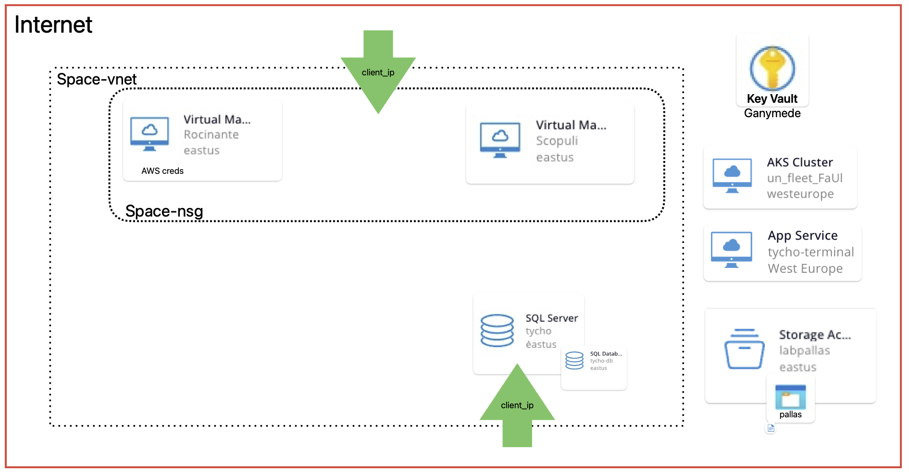

# Expanse Azure Security Lab

This lab has been built for testing, learning, and teaching different attack paths and security "flaws" in Azure. Deploy it in your own tenant to explore Azure security in a controlled environment.

It is intended to be rolled out in your own Azure tenant. You need fairly high privileges to roll this lab out:
1. Contributor on the subscription you want to create the resources in.
2. User Admin or something similar on tenant level, since we create a lot of Users/SPs

The Terraform script will create several resources in the configured tenant and subscription.
All custom roles and permissions are only scoped to the newly created resource groups, but keep in mind that Azure Users tend to be able to read the full tenant level user database. It is therefore advised to deploy the lab in a test tenant only, never on any productive tenant. 

**Disclaimer**: While efforts were made to keep the permissions and exploits in the lab sound and contained within sensible boundaries, **this lab creates some VERY vulnerable resources**. It comes with no warranty at all - if someone breaks into your tenant using the lab as an entry point, don't say I did not warn you :).

All Terraform related operations have to be conducted from inside the `tfscripts` folder. This is also the place to change configuration etc.

## Configuration

### terraform.tfvars

Create a copy of the `terraform.tfvars.example` file with the name `terraform.tfvars`. This will be your lab configuration.
Configure your public IP as `client_ip`, your `subscription_id` in the `terraform.tfvars` file. If needed you can also change the deployment region in that file.
```
client_ip = "198.51.100.1" # Public IP for firewall whitelisting on DBs and VMs.
subscription_id = "12345678-1234-1234-1234-123456781234"
```
If you do not know your subscription_id, navigate to `Subscriptions` in the Azure Portal, choose the right subscription and copy the ID:






You can set a name for the resource group that will be holding your lab resources via the parameter:
`resource_grp_name = "ExpanseAzureSecLab"`. While the default is fine, it might make sense to make different instances distinguishable. 

In this configuration, you can also configure the SSH keys for the `Rocinante` and `Scopuli` VMs. Just create fresh keypair(s) and put the public part in the `terraform.tfvars` file:


```
rocinante_ssh_key = "ssh-rsa ..."
scopuli_ssh_key = "ssh-rsa ..."
```

You should also set a unique identifier that will be part of all user principal / service principal names to map them if needed via the parameter `lab_uniq_id`. No special characters are allowed for this parameter since it breaks resource names otherwise.

Also set an administrator password for the tycho db server via the parameter: `tycho_sa_password`.

Last, decide on how long you want your service account secrets to be valid and cofigure via the `end_date` parameter.

### users.csv

Create a copy of the `users.csv.example` file with the name `users.csv`. This will be your lab configuration for the users. 

Set passwords for your users. Be mindful of password complexity requirements in your tenant.
If needed you can also configure additional users in the `users.csv` file. The `job_title` field determines the permissions of a user. Role bindings and custom roles are defined in the `main.tf` file if you want to alter them.

The jobs currently give the following permissions:

**Crew:**
`Virtual Machine User Login` on the `Rocinante` VM.
`Key Vault Administrator` on the `Ganymede` Key Vault.

**Pilot:**
The custom `VM_Rocinante_RunCommand_ExtensionsWrite` role which yields the following permissions:
```
"Microsoft.Compute/virtualMachines/runCommand/*",
"Microsoft.Compute/virtualMachines/extensions/*",
"Microsoft.Compute/virtualMachines/read"
```
on the `Rocinante` VM.

**Captain:**
`Virtual Machine Contributor` on the `Rocinante` VM.

**Secretary General:**
`Cluster Admin` on "Earthfleet" AKS cluster and `Microsoft.ContainerService/managedClusters/*` via the `aks_sg_admin` custom role.

## Deployment

You will need `azure cli` and `terraform` installed locally (or use Azure Cloud Shell, not advised) to deploy the lab.

First, make sure you are logged in via `az login` (only needed in a local CLI, not in Cloud Shell)

The lab will deploy in the tenant of your currently logged-in user, check that it is the correct one!
You can double-check with:
`az account show`

Make sure you are inside the `tfscripts` folder for the following commands.

Initialize Terraform (download necessary providers etc.)

```
terraform init
```

Then we deploy the user definitions. This has to happen before the other steps because of dependencies in `for_each` loops.
```
terraform apply -target azuread_user.users
```
Then create all the service principals, which basically clones the users into SPs. They allow for testing and playing around without needing to configure MFA:
```
terraform apply -target azuread_service_principal.sp
```

Afterwards, apply the rest of the TF script with:
```
terraform apply
```

Make sure to accept the changes by typing `yes` when Terraform asks for confirmation. After successfully creating the lab environment, the `tycho_terminal_webapp_fqdn` is printed. This is the starting point for a CTF you can try.
If you instead want a VERY verbose output for direct access to all users and resources, set the `verbose` flag in the `terraform.tfvars` file to true:
```
KeysToTheScopuli_MI_principal_id = "12345678-1234-1234-1234-123456781234"
Rocinante_admin_user = "kelly"
Rocinante_public_IP = "198.51.100.1"
Scopuli_admin_user = "darren"
Scopuli_public_IP = "198.51.100.2"
Users = [
  "akamal[lab_uniq_id]@[tenant-domain]:[yourpassword]",
  "aburton[lab_uniq_id]@[tenant-domain]:[yourpassword]",
  "bdraper[lab_uniq_id]@[tenant-domain]:[yourpassword]",
  "cdrummer[lab_uniq_id]@[tenant-domain]:[yourpassword]",
  "cavasarala[lab_uniq_id]@[tenant-domain]:[yourpassword]",
  "cmao[lab_uniq_id]@[tenant-domain]:[yourpassword]",
  "finaros[lab_uniq_id]@[tenant-domain]:[yourpassword]",
  "jholden[lab_uniq_id]@[tenant-domain]:[yourpassword]",
  "jmiller[lab_uniq_id]@[tenant-domain]:[yourpassword]",
  "minaros[lab_uniq_id]@[tenant-domain]:[yourpassword]",
  "nnagata[lab_uniq_id]@[tenant-domain]:[yourpassword]",
]
priv_sp_proto_client_id = "12345678-1234-1234-1234-123456781234"
priv_sp_proto_client_secret = "[redacted]"
sp_credentials = {
  "Alex" = {
    "app_id" = "0f989852-495f-4c42-8f1b-14ca655ee32d"
    "password" = "[redacted]"
  }
  "Amos" = {
    "app_id" = "ee507659-4a45-4e8d-a184-b8147448bf4a"
    "password" = "[redacted]"
  }
  "Bobbie" = {
    "app_id" = "fcb07c2c-aa6e-4327-9ee3-17e50c0de188"
    "password" = "[redacted]"
  }
  "Camina" = {
    "app_id" = "5a0d32e7-7efa-447b-8095-0c379cb1656d"
    "password" = "[redacted]"
  }
  "Chrisjen" = {
    "app_id" = "a61b8651-29f5-4400-ad06-6d199b97ab44"
    "password" = "[redacted]"
  }
  "Clarissa" = {
    "app_id" = "145fcb8e-a6b5-4013-8929-74b777719cce"
    "password" = "[redacted]"
  }
  "Filip" = {
    "app_id" = "abcf1367-cf9e-44cc-bbb0-8cd42d89feed"
    "password" = "[redacted]"
  }
  "Jim" = {
    "app_id" = "714fd878-191a-4d26-a9a9-a58254997f50"
    "password" = "[redacted]"
  }
  "Josephus" = {
    "app_id" = "4cb1e538-c654-47bb-a617-7acc0a560a1e"
    "password" = "[redacted]"
  }
  "Marco" = {
    "app_id" = "452f1e15-f17b-4106-a498-e4396fc0d81a"
    "password" = "[redacted]"
  }
  "Naomi" = {
    "app_id" = "dc9e9e82-b9df-40ee-a5ee-88c37aef3fab"
    "password" = "[redacted]"
  }
}
tenant_id = "yourtenantid"
tycho_db_sa_sp_client_id = "96a7d1d6-ce74-4fb4-b577-da55563c97fc"
tycho_db_sp_client_secret = "[redacted]"
tycho_fqdn = "[your_tycho_random_name].database.windows.net"
whitelisted_client_ip = "The client_ip [your_ip] is whitelisted in the DB and VM firewalls."
```
The public IPs of the VMs allow for SSH connections using the configured SSH key and the user from the output.

Additionally, a highly privileged service principal (`Contributor` on the resource group) is created, which can be used as an additional entry point. The data needed is printed as `priv_sp_proto_client_id`, `priv_sp_proto_client_secret`, and `tenant_id`. 

An additional SP is created as an administrator of the `Tycho` database. Use `tycho_db_sa_sp_client_id` and `tycho_db_sp_client_secret` along with the `tenant_id` again.

The users `Alex` and `Jim` have code execution privileges on the `Rocinante` VM and can therefore also be used as a direct entry.

For manual testing of managed identity scenarios, the principal ID of the `KeysToTheScopuli` user-assigned managed identity is provided. This identity is attached to the `Rocinante` VM and allows for `RunCommand` and `Extensions/Write` access on the `Scopuli` VM.

Now the lab should be correctly configured in you Azure subscription inside a new resource group `lab_uniq_id-ExpanseAzureSecLab` (depending on your configuration).

**In case of errors when rolling out:**
First, try to run `terraform apply` again. Sometimes the Azure backend is too slow in updating information in the background and Terraform may read stale role/identity info due to Azure propagation delays. If rolling out the lab permanently does not work open an issue.

## Architecture

The general assets can be found in the following diagram (or `AzureLabAssets.pdf`):


There also is a nice diagram illustrating the architecture of the lab containing most valuable loot and most role/permission links, therefore also serving as a kind of attack map. The diagram might not be exhaustive, maybe you will find more ;). This one can be found in the `attacks` folder.

Refer to the `AzureLab_Architecture.pdf`.

## Destroying / Clean-up
To clean up the lab, use the 
```
terraform destroy
```
command.

This works like a charm and I did not have any problems in the last several iterations of the lab.

In case something still goes wrong here and not everything is cleaned up (happens very rarely) just try again to:
```
terraform destroy
```

After performing the destroy, all resources and users are deleted. To redeploy, perform the deployment steps again.


You might run into the `for each` dependency issues again here. In that case first do:
```
terraform apply -target azuread_user.users
terraform apply -target azuread_service_principal.sp
```
followed by an additional 
```
terraform destroy
```

In bad cases repeat this twice, then open an issue. Normally everything should be cleaned up after the **first** `destroy` operation.

---

**License:** This project is licensed under GPL-3.0. See [LICENSE](LICENSE) for details.

This project is not officially affiliated with "The Expanse" brand or its rights holders—the theme is just for fun.
